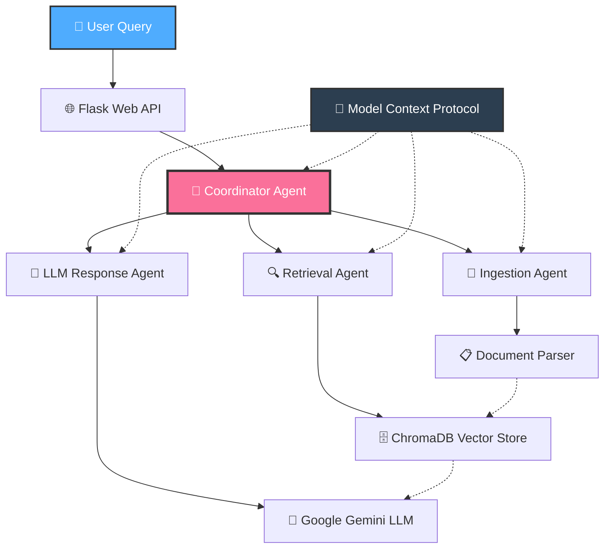

# 🤖 Multi-Documents Agentic RAG with Model Context Protocol (MCP)

[](https://www.python.org/downloads/)
[](https://opensource.org/licenses/MIT)
[](https://flask.palletsprojects.com/)
[](https://www.trychroma.com/)
[](https://ai.google.dev/)

A sophisticated **multi-agent Retrieval-Augmented Generation (RAG)** system that processes multi-format documents and answers user queries using an agentic architecture with **Model Context Protocol (MCP)** for seamless inter-agent communication.

## 📺 **Demo Video Demonstration**

🎥 **Watch the complete system walkthrough:**  
[](https://drive.google.com/file/d/1zAwkd-uqBUd2xuKAePTtoB6ZnWNMgr4M/view?usp=sharing)

Demo Video LINK :-   https://drive.google.com/file/d/1zAwkd-uqBUd2xuKAePTtoB6ZnWNMgr4M/view?usp=sharing

*Click the badge above to see the system in action - document upload, processing, querying, and real-time agent coordination!*

---

## 🏗️ **System Architecture**

### **High-Level Architecture Overview**



### **Detailed Component Architecture**

<div align="center">
  
  <p><em>📊 Interactive architecture diagram available when running the application</em></p>
</div>

```
┌─────────────────────────────────────────────────────────────────────────────┐
│                            🌐 User Interface Layer                          │
├─────────────────────────────────────────────────────────────────────────────┤
│                            🔗 Flask API Gateway                             │
├─────────────────────────────────────────────────────────────────────────────┤
│                          🎯 Coordinator Agent (MCP)                         │
├─────────────────┬─────────────────┬─────────────────┬─────────────────────────┤
│  📄 Ingestion   │  🔍 Retrieval    │  🧠 LLM Agent   │   📊 Health Monitor     │
│     Agent       │     Agent       │                 │                         │
├─────────────────┼─────────────────┼─────────────────┼─────────────────────────┤
│ 📋 Doc Parser   │ 🗄️ ChromaDB      │ 🤖 Gemini LLM   │   📈 Statistics         │
│ • PDF, DOCX     │ • Vector Store  │ • gemini-2.0    │   • Performance         │  
│ • PPTX, CSV     │ • Semantic      │   -flash        │   • Error Tracking      │
│ • TXT, MD       │   Search        │ • Context Aware │   • Agent Status        │
└─────────────────┴─────────────────┴─────────────────┴─────────────────────────┘
                              ⬇️
┌─────────────────────────────────────────────────────────────────────────────┐
│              📡 Model Context Protocol (MCP) Communication Bus              │
│    • Type-safe Messaging  • Trace IDs  • Error Propagation  • Priority      │
└─────────────────────────────────────────────────────────────────────────────┘
```

---

## 🚀 **Key Features**

### 🤖 **Multi-Agent Architecture**
- **🎯 Coordinator Agent**: Orchestrates the entire pipeline and manages agent communication
- **📄 Ingestion Agent**: Processes and parses documents from multiple formats
- **🔍 Retrieval Agent**: Manages vector storage and semantic search
- **🧠 LLM Response Agent**: Generates contextual responses using Google Gemini

### 📋 **Enhanced Document Processing**
- **📄 Multi-format Support**: PDF, DOCX, PPTX, CSV, TXT, MD
- **🔧 Intelligent Chunking**: Advanced text segmentation with overlap strategies
- **🏷️ Metadata Preservation**: Maintains document structure and source information
- **⚠️ Error Handling**: Robust processing with detailed error reporting

### 🗄️ **Advanced Vector Storage**
- **🔗 ChromaDB Integration**: Persistent vector storage with metadata
- **🔍 Semantic Search**: Enhanced search with similarity scoring
- **📁 File-based Filtering**: Search within specific documents
- **📚 Collection Management**: Clear, update, and manage document collections

### 📡 **Model Context Protocol (MCP)**
- **💬 Structured Messaging**: Type-safe inter-agent communication
- **🔍 Message Tracing**: Full request tracing with unique IDs
- **⚠️ Error Propagation**: Comprehensive error handling across agents
- **⚡ Priority Handling**: Message prioritization and routing

### 🏭 **Production-Ready Features**
- **❤️ Health Monitoring**: System health checks and agent status
- **📊 Statistics Tracking**: Comprehensive performance metrics
- **📝 Logging**: Structured logging with multiple handlers
- **⚙️ Configuration Management**: Environment-based configuration
- **📖 API Documentation**: RESTful API with proper error responses

---

## 🛠️ **Installation & Setup**

### **Prerequisites**
- 🐍 Python 3.10+
- 🔑 Google Gemini API Key
- 💾 At least 4GB RAM (recommended)
- 💿 500MB disk space

### **Quick Start**

```bash
# 1️⃣ Clone the repository
git clone https://github.com/yourusername/agentic-rag-mcp.git
cd agentic-rag-mcp

# 2️⃣ Create virtual environment
python -m venv .venv
source .venv/bin/activate  # On Windows: .venv\Scripts\activate

# 3️⃣ Install dependencies
pip install -r requirements.txt

# 4️⃣ Configure environment
cp .env.example .env
# Edit .env with your API keys

# 5️⃣ Run the application
python app.py
```

### **🔧 Environment Configuration**

Create a `.env` file with the following variables:

```bash
# 🔑 Required
GEMINI_API_KEY=your_gemini_api_key_here

# ⚙️ Agent Configuration (Optional)
CHUNK_SIZE=1000
CHUNK_OVERLAP=200
DEFAULT_SEARCH_K=5
EMBEDDING_MODEL=all-MiniLM-L6-v2
LLM_MODEL=gemini-2.0-flash

# 🖥️ System Configuration (Optional)
MAX_FILE_SIZE_MB=32
UPLOAD_FOLDER=uploads
LOG_LEVEL=INFO
API_HOST=0.0.0.0
API_PORT=8000
DEBUG=true
```

---

## 📖 **API Documentation**

### **📤 Upload Documents**
```http
POST /upload
Content-Type: multipart/form-data

files: [file1.pdf, file2.docx, file3.pptx, ...]
```

**Response:**
```json
{
  "uploaded_files": ["file1.pdf", "file2.docx"],
  "failed_files": [],
  "processing_results": [
    {
      "filename": "file1.pdf",
      "chunks_processed": 15,
      "processing_time": 2.34,
      "trace_id": "uuid-here"
    }
  ],
  "message": "Successfully processed 2 files"
}
```

### **🔍 Query Documents**
```http
POST /query
Content-Type: application/json

{
  "query": "What are the main KPIs discussed in the quarterly report?",
  "search_k": 5,
  "file_filter": "quarterly_report.pdf" 
}
```

**Response:**
```json
{
  "answer": "Based on the uploaded documents, the main KPIs discussed include...",
  "context_chunks": ["Revenue increased by 15%...", "Customer satisfaction..."],
  "sources_used": 3,
  "response_type": "rag",
  "collection_size": 45,
  "processing_time": 1.23,
  "trace_id": "uuid-here",
  "metadata": {
    "query_length": 35,
    "search_k": 5,
    "timestamp": "2024-01-01T12:00:00"
  }
}
```

### **❤️ System Health**
```http
GET /health
```

### **📊 System Statistics**
```http
GET /stats
```

### **🗑️ Clear Documents**
```http
POST /clear
```

---

## 📡 **Model Context Protocol (MCP)**

### **💬 Message Structure**
```python
@dataclass
class MCPMessage:
    sender: str          # Agent identifier
    receiver: str        # Target agent
    type: str           # Message type
    trace_id: str       # Unique tracing ID
    payload: Dict[str, Any]  # Message data
    timestamp: float    # Unix timestamp
    priority: MessagePriority  # HIGH, MEDIUM, LOW
    error: Optional[str]       # Error information
    metadata: Dict[str, Any]   # Additional context
```

### **📨 Message Types**
- `DOCUMENT_PROCESSED`: Document ingestion complete
- `DOCUMENTS_INDEXED`: Vector indexing complete  
- `CONTEXT_RESPONSE`: Retrieval results
- `RESPONSE_GENERATED`: LLM response ready
- `ERROR`: Error occurred
- `HEALTH_CHECK`: Agent health status

### **🔄 Sample Workflow**

```
📤 User uploads: sales_report.pdf, metrics.csv
💬 User query: "What KPIs were tracked in Q1?"

🎯 CoordinatorAgent receives query
   ├── 📄 IngestionAgent: "PARSE_DOCUMENTS"
   ├── 🔍 RetrievalAgent: "SEARCH_CONTEXT" 
   └── 🧠 LLMResponseAgent: "GENERATE_RESPONSE"

📡 MCP Message Flow:
   IngestionAgent → RetrievalAgent: "DOCUMENTS_INDEXED"
   RetrievalAgent → LLMResponseAgent: "CONTEXT_RESPONSE"
   LLMResponseAgent → CoordinatorAgent: "RESPONSE_GENERATED"

📋 Final Response: Structured answer with sources
```

**MCP Message Example:**
```json
{
  "type": "CONTEXT_RESPONSE",
  "sender": "RetrievalAgent", 
  "receiver": "LLMResponseAgent",
  "trace_id": "rag-abc123",
  "payload": {
    "retrieved_context": [
      "Q1 revenue growth: 15% YoY increase...",
      "Customer acquisition cost decreased by 8%...",
      "Monthly recurring revenue reached $2.3M..."
    ],
    "query": "What KPIs were tracked in Q1?",
    "similarity_scores": [0.89, 0.85, 0.82]
  },
  "priority": "HIGH",
  "timestamp": 1703174400.0,
  "metadata": {
    "search_time_ms": 245,
    "documents_searched": 3,
    "chunks_retrieved": 5
  }
}
```

---

## 🧪 **Testing & Development**

### **🚀 Quick Test**
```bash
# Run MCP workflow demonstration
python mcp_workflow_example.py

# Start main application
python app.py

# Test basic MCP functionality  
python test_mcp_basic.py
```

### **🌐 Web Interface Testing**
1. Navigate to `http://localhost:8000`
2. Upload test documents (PDF, DOCX, CSV, etc.)
3. Ask questions about document content
4. Monitor system health at `/health`
5. Check performance statistics at `/stats`

### **📊 Health Monitoring**
```bash
# Check system status
curl http://localhost:8000/health

# Get performance statistics
curl http://localhost:8000/stats

# View agent communication logs
tail -f app.log | grep "MCP"
```

---

## 🚧 **Challenges Faced & Solutions**

### **⚠️ Development Challenges**

1. **🔄 Agent Coordination Complexity**
   - **Challenge**: Managing message passing between multiple agents while maintaining state consistency
   - **Solution**: Implemented MCP with unique trace IDs and message queuing

2. **⚠️ Error Propagation**
   - **Challenge**: Ensuring errors are properly handled and traced across the entire pipeline  
   - **Solution**: Built comprehensive error propagation system with structured logging

3. **⚡ Performance Optimization**
   - **Challenge**: Balancing chunk size, overlap, and search parameters for optimal retrieval
   - **Solution**: Implemented configurable parameters with performance monitoring

4. **💾 Memory Management**
   - **Challenge**: Handling large document collections without memory leaks
   - **Solution**: Efficient chunking strategies and garbage collection optimization

5. **📡 MCP Protocol Implementation**
   - **Challenge**: Creating robust, type-safe communication between agents
   - **Solution**: Developed structured message format with validation and error handling

---

## 🔮 **Future Improvements**

### **🚀 Performance Enhancements**
- **⚡ Caching Layer**: Redis integration for frequently accessed chunks
- **🔄 Async Processing**: Background job queue for large document processing  
- **🧠 Advanced Chunking**: Semantic chunking based on document structure

### **🌐 Multi-Model Support**
- **🤖 Multiple LLM Providers**: OpenAI, Anthropic, Claude integration
- **🔍 Hybrid Search**: Combine semantic and keyword search
- **📊 Model Comparison**: A/B testing for different models

### **🏭 Production Features**
- **🔒 Authentication**: OAuth2/JWT implementation
- **📊 Advanced Analytics**: Query pattern analysis and optimization
- **🔄 Real-time Updates**: WebSocket support for live processing status
- **📦 Batch Processing**: Bulk document upload and processing

### **🏗️ Infrastructure**
- **🐳 Containerization**: Docker and Kubernetes deployment
- **📈 Monitoring**: Prometheus/Grafana integration
- **⚖️ Load Balancing**: Multiple agent instances for high availability
- **🔌 Plugin Architecture**: Extensible system for custom processors

---

## 📊 **System Monitoring & Observability**

### **📈 Metrics**
- Document processing statistics
- Query response times and accuracy
- Agent health status monitoring
- Vector store performance metrics

### **❤️ Health Checks**
- Individual agent health monitoring
- System-wide health aggregation  
- API connectivity and dependency testing
- Automated alerting for failures

---

## 🔒 **Security & Best Practices**

### **🛡️ Security Features**
- File type validation and sanitization
- Size limits enforcement (configurable)
- Secure filename handling
- API key protection and rotation
- Input sanitization and validation

### **📋 Best Practices**
- Environment-based configuration
- Comprehensive error handling
- Resource cleanup and management
- Rate limiting and throttling
- Audit logging for compliance

---

## 🤝 **Contributing**

I welcome contributions! Please follow these steps:

1. **🍴 Fork** the repository
2. **🌿 Create** a feature branch (`git checkout -b feature/amazing-feature`)
3. **💾 Commit** your changes (`git commit -m 'Add amazing feature'`)
4. **📤 Push** to the branch (`git push origin feature/amazing-feature`)
5. **🔄 Open** a Pull Request

### **📋 Development Guidelines**
- Follow PEP 8 style guidelines
- Add tests for new features
- Update documentation as needed
- Ensure all tests pass before submitting


## 🛠️ **Troubleshooting**

### **❓ Common Issues**

| Issue | Solution |
|-------|----------|
| **🔑 API Key Error** | Ensure `GEMINI_API_KEY` is set in `.env` file |
| **📤 File Upload Fails** | Check file size limits and supported formats |
| **🔍 No Search Results** | Verify documents are properly indexed in ChromaDB |
| **💾 Memory Issues** | Reduce chunk size or file count, increase system RAM |
| **🔌 Connection Errors** | Check internet connectivity and API endpoints |

### **🔧 Debug Mode**
```bash
export LOG_LEVEL=DEBUG
python app.py
```

### **📊 System Health Check**
```bash
# Quick health verification
curl -s http://localhost:8000/health | jq '.'

# Detailed system statistics  
curl -s http://localhost:8000/stats | jq '.'
```

---

## 📄 **License**

This project is licensed under the **MIT License** - see the [LICENSE](LICENSE) file for details.

---

## 🙏 **Acknowledgments**

- **🤖 Google Gemini** for powerful LLM capabilities
- **🗄️ ChromaDB** for efficient vector storage
- **🐍 Flask** for robust web framework
- **📚 Sentence Transformers** for embedding generation
- **🧠 Hugging Face** for transformer models

---

<div align="center">

### **🌟 Built with ❤️ using Python, Flask, ChromaDB, and Google Gemini LLM **

[](https://www.python.org/)
[](https://ai.google.dev/)
[](https://www.trychroma.com/)

**⭐ If this project helped you, please give it a star!**

[🎬 **Watch Demo**](https://drive.google.com/file/d/1zAwkd-uqBUd2xuKAePTtoB6ZnWNMgr4M/view?usp=sharing) • [📚 **Documentation**](#api-documentation) • [🐛 **Report Bug**](https://github.com/yourusername/agentic-rag-mcp/issues) • [💡 **Request Feature**](https://github.com/yourusername/agentic-rag-mcp/issues)

</div>
---

## 📞 **Support & Community**

### **🆘 Getting Help**
- Email :- jashwanthboddupally@gmail.com
- Cell No :- 9010767269
- linkedIn :- [LinkedIN](#https://www.linkedin.com/in/jashwanth-boddupally-64068b289/)
- Portfolio :- [Portfilio](#https://jashu171.github.io/portfolio/)
- 📖 Check the [documentation](#api-documentation)
- 🔍 Review [troubleshooting](#troubleshooting) section
- 📝 Check existing [GitHub Issues](https://github.com/jashu171/agentic-rag-mcp/issues)
---
